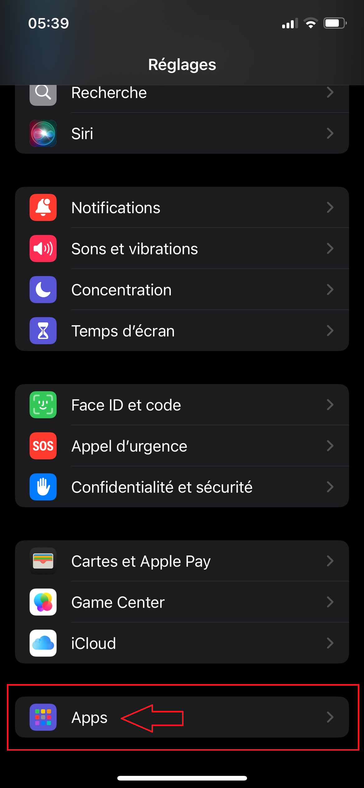
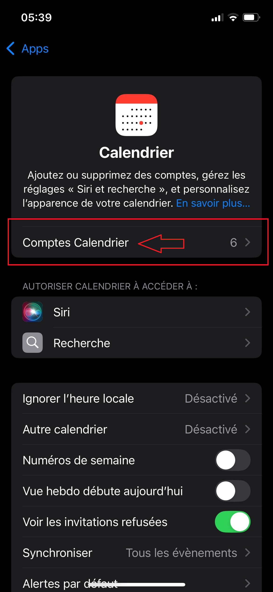
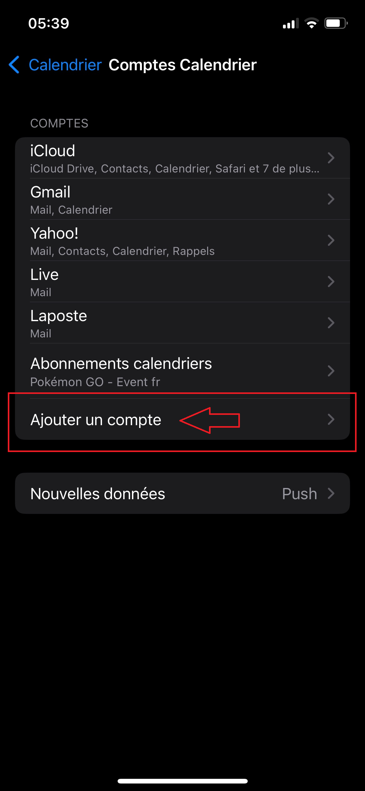
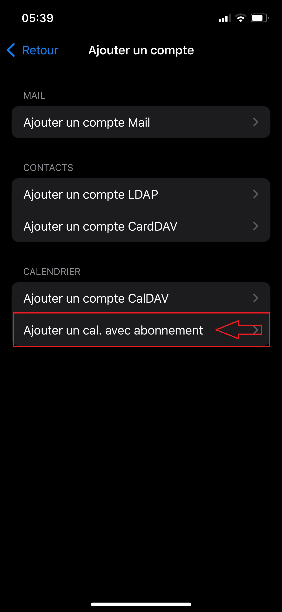
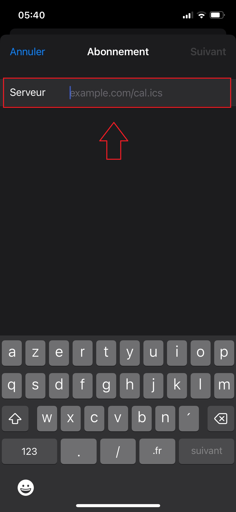
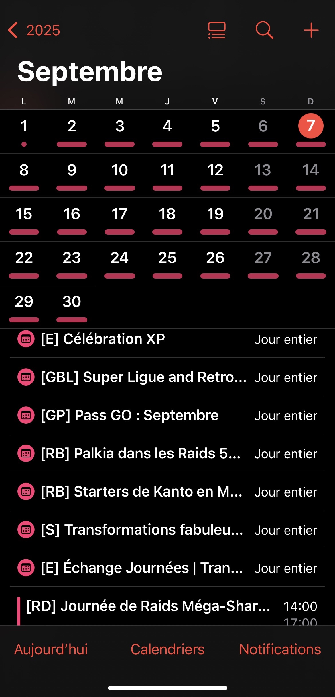
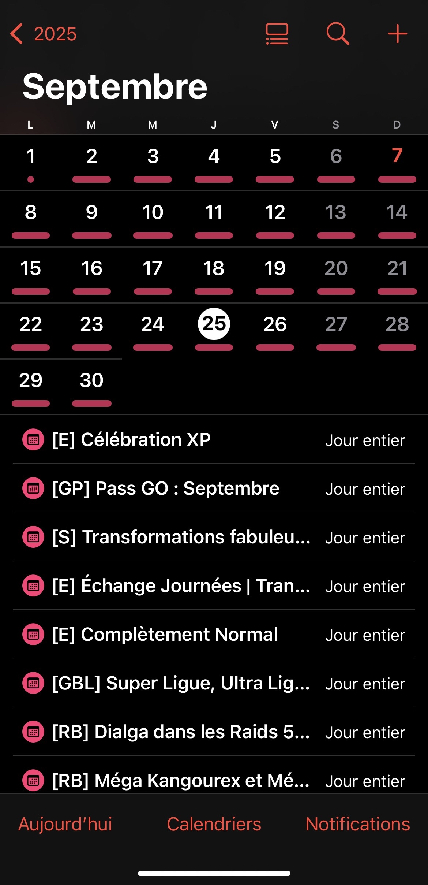

# 📅 Calendrier Pokémon GO – FR
**Dépôt : [SneakyOnTv/pokemon-go-calendar-fr](https://github.com/SneakyOnTv/pokemon-go-calendar-fr)**

Un calendrier **Pokémon GO** entièrement traduit en français, mis à jour automatiquement à partir de la source officielle :  
[GO Calendar (gocal.ics)](https://github.com/othyn/go-calendar)

Il inclut : événements spéciaux, Journées Communauté, raids, bonus XP x2, Poussière d’étoiles x2, et plus encore.

⚡ **Objectif** : avoir un calendrier **100% français**, clair et toujours à jour, directement sur iPhone, Android ou Google Agenda.

---

## 🌐 Accès au calendrier

### 1️⃣ Version interactive (Vercel)
Filtrez les événements que vous souhaitez inclure avant de générer votre calendrier :  
👉 [https://pokemon-go-calendar-fr.vercel.app/](https://pokemon-go-calendar-fr.vercel.app/)  

> 💡 Idéal pour personnaliser les événements à suivre (ex : uniquement les raids ou les Journées Communauté).

### 2️⃣ Version complète (GitHub Pages)
Pour obtenir le calendrier complet sans filtrage :  
👉 [https://sneakyontv.github.io/pokemon-go-calendar-fr/calendar/gocal_fr.ics](https://sneakyontv.github.io/pokemon-go-calendar-fr/calendar/gocal_fr.ics)  

> ⚠️ Important : copier **tout l’URL https jusqu’au `.ics`**.

---

## 📱 Installation rapide

### iPhone (iOS) – Tuto illustré

1. **Ouvrir l’application Calendrier et accéder aux comptes**  
   

2. **Compte Calendrier**  
   

3. **Ajouter un compte**  
   

4. **Choisir “Autre”**  
   

5. **Ajouter un calendrier avec abonnement**  
   

6. **Coller le lien du calendrier dans “Serveur”**  
   👉 [Lien calendrier complet ICS](https://sneakyontv.github.io/pokemon-go-calendar-fr/calendar/gocal_fr.ics)  
   

7. **Valider** → Le calendrier apparaît dans l’application **Calendrier**.

8. **Configurer les alertes**  
   - Matin pour événements journée entière  
   - 30–45 min avant pour les raids

---

### Android (Google Agenda)

**Méthode 1 : Import manuel**  
1. Téléchargez le fichier :  
   👉 [Lien calendrier complet ICS](https://sneakyontv.github.io/pokemon-go-calendar-fr/calendar/gocal_fr.ics)  
2. Ouvrez le fichier depuis votre barre de notifications ou dossier Téléchargements.  
3. Ajoutez le calendrier à votre agenda → **Tout ajouter**.

**Méthode 2 : Via l’URL (recommandée)**  
1. Sur PC, ouvrez Google Agenda → **Autres agendas → + → À partir de l’URL**  
2. Collez le lien :  
   👉 [Lien calendrier complet ICS](https://sneakyontv.github.io/pokemon-go-calendar-fr/calendar/gocal_fr.ics)  
3. Ajouter → synchronisation automatique sur mobile

---

### Outlook

1. Ajouter un calendrier → **À partir d’Internet**  
2. Collez le lien webcal :  
   👉 [Lien calendrier complet ICS](https://sneakyontv.github.io/pokemon-go-calendar-fr/calendar/gocal_fr.ics)  
3. Valider

---

## 🛠️ Fonctionnement technique

- Téléchargement automatique du fichier source anglais `gocal.ics`  
- Traduction avec dictionnaire FR + corrections manuelles (Pokémon, abréviations, etc.)  
- Ajout de rappels **(30 et 45 minutes avant les raids)**  
- Génération d’un fichier `calendar/gocal_fr.ics`

⚡ **Automatisation GitHub Actions**  
- Le fichier est régénéré **toutes les 6h** :  
  - 🕕 06h00  
  - 🕛 12h00  
  - 🕕 18h00  
  - 🕐 00h01

---

## ✨ Fonctionnalités principales

- Traduction FR fiable avec dictionnaire  
- Mises à jour automatiques plusieurs fois par jour  
- Alertes intégrées pour raids & événements  
- Compatible iPhone, Android, Outlook  
- Filtrage des événements via interface Vercel

---

## 🚀 Améliorations futures

- Mise à jour automatique des nouveaux Pokémon  
- Filtre par événement ([RH], [GBL], etc.)  
- Page web interactive pour sélectionner les événements  
- Catégories améliorées et rappels personnalisés

---

## 🔍 Légende des événements

| Abréviation | Nom anglais                | Nom français              | Description |
|-------------|----------------------------|---------------------------|-------------|
| **[RH]**    | Raid Hour                  | Heure de Raid             | Raids spéciaux concentrés sur un Pokémon. |
| **[RB]**    | Raid Boss                  | Boss de Raid              | Pokémon disponible en tant que boss de Raid. |
| **[PSH]**   | Pokémon Spotlight Hour     | Heure vedette Pokémon     | Apparition accrue d’un Pokémon spécifique. |
| **[CD]**    | Community Day              | Journée Communauté        | Événement avec un Pokémon vedette et des bonus spéciaux. |
| **[GBL]**   | GO Battle League           | Ligue de Combat GO        | Combats PvP avec règles et récompenses. |
| **[WA]**    | Wild Area                  | Zone Sauvage              | Apparitions spéciales dans la nature. |
| **[E]**     | Événement spécial          | Événement                 | Événement global ou local. |
| **[S]**     | Tales of Transformation    | Transformation fabuleuse  | Événement spécial avec des Pokémon et mécaniques uniques. |
| **[MM]**    | Max Monday                 | Lundi Max                 | Raids Dynamax spéciaux. |
| **[RD]**    | Raid Day                   | Journée de Raids          | Raids concentrés sur un Pokémon particulier. |
| **[RW]**    | Raid Weekend               | Week-end de Raids         | Raids intensifs sur plusieurs jours. |
| **[GP]**    | GO Pass                    | Passe GO                  | Suit votre progression pendant une période donnée. |
| **[CS]**    | Catch Special               | Objectifs de capture spéciaux | Objectifs uniques lors d’événements spécifiques. |

---

## 📸 Aperçu du calendrier Pokémon GO

   

💡 Astuce : Les événements apparaissent en **points colorés**, cliquez sur un jour pour voir tous les détails et horaires.

---

## 🙌 Contributeurs

- **[@SneakyOnTv](https://github.com/SneakyOnTv)** → Création et gestion du calendrier FR  
- Source originale : [GO Calendar](https://github.com/othyn/go-calendar)

---

## 📜 Licence

MIT License – Libre d’utilisation et modification
